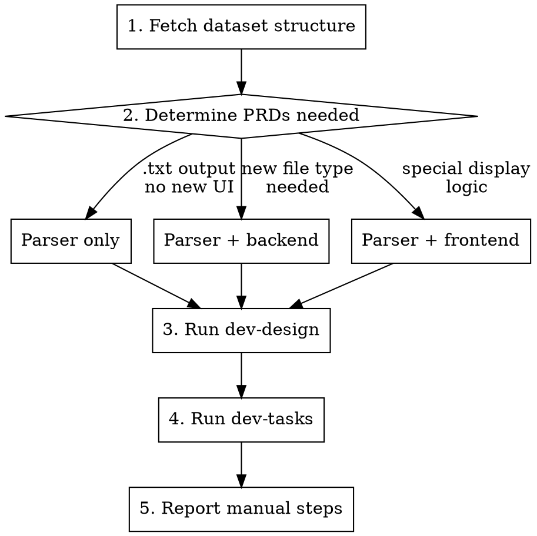

# Add Preset Dataset

## Overview

End-to-end workflow for adding a new preset dataset to Juno. User provides a dataset link and extraction spec; the skill fetches the structure, determines what PRDs are needed, runs `dev-design` and `dev-tasks`, and reports the manual steps.

The result is always: `TASKS.md` files ready for `/dev-code`. No architecture decisions needed from the user beyond the link and what to extract.

## Inputs (all required from user)

| Input | Example |
|---|---|
| Dataset link(s) | GitHub repo URL, specific file URL |
| What to extract | Field names, output format per record |
| Group name | Name for `preset-data/{group}/` (usually dataset name) |
| Input ID convention | How to name each appointment/case subfolder |

## Architecture Reference (do NOT re-derive from files)

### Filesystem contract
```
preset-data/
  {group}/          ← dataset name, e.g. "primock57"
    {input_id}/     ← one appointment/case, e.g. "day1-consultation01"
      file.txt      ← one or more files per appointment
```
`files[]` in the API is taken from the **first input only** — all inputs in a group must have the same file names.

### Runtime reader: `backend/utils/preset_data.py`
- `list_datasets()` → scans group dirs, returns `{group, inputs[], files[]}`
- `read_dataset_file(group, input_id, filename)` → raw bytes
- No changes needed here for a new dataset (it's generic)

### Text extraction: `backend/routes/care_plan.py` → `_extract_text_from_bytes`
Handles: `.txt` (UTF-8 passthrough), `.pdf`, `.docx`.
**If the parser outputs `.txt` files → zero backend changes needed.**
If the dataset needs a new file type → backend change required (add a case).

### Frontend: no changes needed for standard datasets
`DatasetGroupRow` already handles any group/input/file structure. Only add a frontend SP if the dataset needs special display logic.

### Parser convention
```
backend/utils/preset_data_parser/
  {dataset_name}/
    __init__.py     ← empty
    parser.py       ← standalone CLI script
```
`_DEFAULT_DEST = Path(__file__).resolve().parents[4] / "preset-data"` — always correct (4 levels from parser.py to repo root).

## Process



### Step 1 — Fetch and understand the dataset

Use `gh api` (for GitHub) or `WebFetch` to retrieve a sample file from the dataset. Understand:
- File format (JSON, CSV, XML, etc.)
- Field names for what to extract
- Naming convention for appointments/cases (determines `input_id` slugs)
- Total record count

### Step 2 — Determine which PRDs to create

Always create: **parser SP** (offline ingestion script).

Create **backend SP** if:
- The parser cannot output `.txt` cleanly (e.g. binary format, multi-modal)
- A new file type is needed that `_extract_text_from_bytes` doesn't handle

Create **frontend SP** if:
- The dataset has a fundamentally different selection model (e.g. hierarchical grouping)
- Special metadata needs displaying per group that `DatasetGroupRow` doesn't support
- (Standard datasets: no frontend SP needed)

### Step 3 — Run `dev-design`

Invoke the `dev-design` skill. Brief it with:
- All locked decisions below (copy verbatim as context)
- The specific sub-projects determined in Step 2
- The dataset's JSON structure (verified from Step 1)
- Today's task folder: `docs/agent_files/tasks/YYYY-MM-DD/` (pick next available number)

**Locked decisions to pass to every parser PRD agent:**
```
- Parser is an OFFLINE, one-time ingestion script. Not called at runtime.
- Parser lives in backend/utils/preset_data_parser/{dataset_name}/parser.py
- _DEFAULT_DEST = Path(__file__).resolve().parents[4] / "preset-data"
- Output per appointment: {dest}/{group}/{input_id}/consultation_notes.txt (or equivalent)
- All inputs in a group must have the same output filenames.
- Default overwrite behavior: skip existing files; --overwrite flag to replace.
- No shared base class across parsers (YAGNI).
- Test import path: from utils.preset_data_parser.{dataset}.parser import ... (not backend.utils...)
  because conftest.py puts backend/ on sys.path[0].
- .gitignore rule: add {dataset_name}/ to exclude source downloads from git.
- Generated preset-data/**/*.txt files ARE tracked (existing !preset-data/**/*.txt rule).
```

### Step 4 — Run `dev-tasks`

Invoke the `dev-tasks` skill on all PRDs from Step 3. Dispatch agents in parallel (one per PRD).

### Step 5 — Report manual steps

Always include:
```bash
# 1. Download dataset
git clone {dataset_url} /tmp/{dataset_name}

# 2. Run parser
python -m backend.utils.preset_data_parser.{dataset_name}.parser \
    --source /tmp/{dataset_name}

# 3. Verify
ls preset-data/{group}/ | head -5
cat preset-data/{group}/{first_input_id}/consultation_notes.txt

# 4. Commit generated files
git add preset-data/{group}/
git commit -m "Add {dataset_name} preset data (N consultations)"
```

## Output Format Template

Every parser writes `.txt` files. Output format is defined by the user's extraction spec, but must be plain text that the pipeline can process as a clinical note. Typical pattern:

```
{Label 1}: {value1}
{Label 2}: {value2}
```

Example (primock57):
```
Presenting Complaint: {presenting_complaint}
Notes: {note}
```

## What NOT to do

- Do not add a manifest or static file copying step — the backend API serves preset-data files directly.
- Do not change `utils/preset_data.py` for a new dataset — it is generic.
- Do not add frontend changes for standard datasets — `DatasetGroupRow` already handles any structure.
- Do not commit the source dataset download — only the generated `.txt` files go in git.
